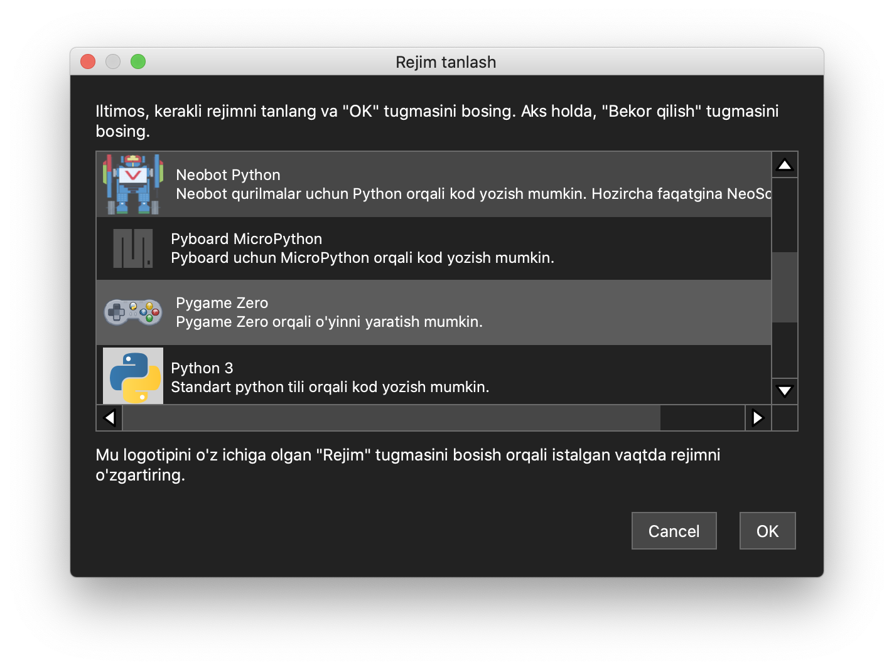

# 2. Dasturlash muhitini tayyorlash

Menimcha, bu har bir dasturlash tilini o'rganish kitobida paydo bo'ladigan birinchi bob. Chunki, sarlavhadan xulosa qilishingiz mumkinki, bu kodlashni boshlash uchun oldindan o'rnatilishi kerak bo'lgan dasturlar mavjudligini anglatadi va ularni o'rnatish va sozlashdan so'ng kodlashni boshlash mumkin bo'ladi.

Odatda, bu jarayon uchun ikkita asosiy talab mavjud. Birinchisi, siz foydalanmoqchi bo'lgan dasturlash tilini (bu holda Python) o'zini o'rnatish, ikkinchisi kodlashni (yoki dasturlashni) osonroq va qulayroq qiladigan yordamchi dasturni o'rnatish, bu kod redaktori (matn redaktori) yoki integratsiyalashgan dasturlash muhiti (Integrated Development Environment — IDE) — bu o'rnatilgan til yordamida kompyuter bilan aloqa qilish uchun mazmunli jumlalar va matnlar yozishni osonlashtiradi.


**Integrated Development Environment (IDE)**: bitta dastur doirasida dasturiy ta'minotni ishlab chiqish bilan bog'liq barcha funktsiyalarni ta'minlaydigan muhitga ega dastur. Dasturiy ta'minotni ishlab chiqish bilan bog'liq barcha ishlar kodni tahrirlash, kompilyatsiya qilish, "debug", "building", binar tarqatish va boshqa dasturchilar bilan hamkorlik qilishni anglatadi. Mashhur mahsulotlarga Microsoft Visual Studio, Google Android Studio kiradi, va faqat Python ga ixtisoslashtirilgan IDE — PyCharm kiradi.


Biroq, ushbu jarayonlar har safar yangi kodlash tilidan foydalanishni boshlaganda bajarilishi kerak bo'lgan odatiy vazifalar bo'lishiga qaramay, ular yangi boshlo'vchilar uchun hali ham noqulay va murakkab bo'lishi mumkin. Misol uchun, agar o'rnatish jarayonida muammolarga duch kelsa va muammolarni bartaraf etishda muammo yuzaga kelsa, ular matnli kodlash qiyin degan noto'g'ri fikrni rivojlantirishi mumkin. Yaxshiyamki, shunga o'xshash tashvishlarga duch kelgan chet ellik dasturchilar/o'qituvchilarning yana bir guruhi bor va ula [Mu Editor deb nomlangan ochiq manbali loyiha](https://github.com/mu-editor/mu)ni boshladilar, bu kod redaktori dasturlash muhitiga qo'shimcha o'rnatmalarsiz darhol kodlashni boshlash uchun zarur bo'lgan hamma narsaga ega. Shuning uchun, kodlashdan tashqari periferik vazifalarni osonlashtirish va soddalashtirish niyatimizga muvofiq, biz Mu Editor(kod redaktori)dan faqat matnli dasturlash mohiyatiga e'tibor qaratish uchun foydalanamiz, bu bizga uni tushunish va o'zlashtirishga chuqurroq kirishga imkon beradi.

## Mu Editor (Kod Redaktori)

O'rnatish uchun [Mu Editor ning rasmiy sayti](https://codewith.mu/en/download)ga kiring va kompyuteringiz muhitiga qarab (kompyuteringizning operatsion tizimiga qarab) eng so'nggi o'rnatuvchini yuklab oling va o'rnating.


Ma'lumotingiz uchun, **men hozirgi vaqtda manba kodini o'zgartirish orqali ochiq manbali Mu Editor ning maxsus versiyasini yaratmoqdaman, bundan maqsad ta'lim uchun avvalgidan ham qulayroq bo'lishdir.** Kerakli manbalar (masalan, rasmlar va o'rnatishni talab qilinadigan qo'shimcha modullar) redaktorga oldindan kiritmoqdaman. **Bu redaktorni dastlabki o'rnatilganidan so'ng, resurslarni alohida onlayn o'rnatishga hojat qolmasligi uchun amalga oshirilmoqda, bu esa hamma narsani oflayn muhitda faqat bitta redaktor bilan qamrab olishga imkon beradi.**

**Bundan tashqari, asl redaktorda yo'q bo'lgan qo'shimcha funktsiyadir. U o'zimiz yaratgan o'yinlarni do'stlarga va boshqalarga tarqatishni osonlashtirish uchun qo'shilgan, bu bizga** [**o'yinlarni bitta EXE faylga aylantirib**](ilova/exe.md) **bahramand bo'lish imkonini beradi.**&#x20;

**Ushbu maxsus redaktor versiyasini sinab ko'rmoqchi bo'lganlar uni** [**bu yerdan**](https://github.com/roboticsware/mu/releases/) **yuklab olishlari mumkin.**


<figure><figcaption>
Mu Editorning rasniy sayti
</figcaption></figure>

Mu Editor ga, dasturlash yordamchisi dasturi sifatida, nima yaqinroq: "oddiy kod redaktori"mi yoki "integratsiyalashgan dasturlash muhiti (IDE) dasturi"mi? Javob ba'zan IDE-ga, ba'zan esa kod redaktoriga yaqinroq bo'lishi mumkin. Mu Editor ning foydalanuvchilariga **istagan turli xil dasturlash muhitlari (rejimlar deb ataladi)** o'rtasida osongina almashishga imkon beradigan xususiyatni taqdim etadi. Python kodlash bo'yicha turli vazifalarni (masalan, umumiy dasturiy ta'minotni dasturlash, o'yin yaratish, apparatlarni boshqarish va boshqalar) osongina bitta redaktor bilan bajarish yangi boshlaganlar uchun juda qulay. Ushbu rejimlarni tanlash uchun siz redaktorning yuqori qismidagi menyuda **Rejim** tugmasini bosishingiz va kerakli (dasturlash) rejimini tanlashingiz mumkin (televizorning masofadan boshqarish pulti bilan televizor kanallarini o'zgartirishga o'xshash) va biz Pygame Zero yordamida o'yin yaratishni rejalashtirayotganimiz sababli, keling Pygame Zero rejimi tanlaylik.

<figure><figcaption>
Rejimni tanlash tugmasi
</figcaption></figure>

<figure><figcaption>
Rejimni tanlash oynasi
</figcaption></figure>

Biz tanlagan kodlash rejimining to'g'riligini joriy tanlangan dasturlash muhiti nima ekanligini ko'rsatadigan holat satri orqali yana bir bor tasdiqlashimiz mumkin.

<figure><figcaption></figcaption></figure>

## Mu Editorning o'zbek tili tarjimasi loyihasi


Yuqoridagi redaktor oynasi avval aytib o'tilganidek, ishlab chiqarilayorgan maxsus versiyadir. Ko'rib turganingizdek, ba'zi o'zbekcha tarjimalar qo'llanilgan va maqsad uni o'zbek tiliga to'liq tarjima qilishdir. Biroq, to'liq tarjima ko'p vaqt talab etadi, biz sizning ishtirokingizni kutmoqdamiz. Tarjimani tezda yakunlash uchun iloji boricha ko'proq odamlarning ishtirokini intiqlik bilan kutamiz va umid qilamizki, hamma birgalikda imtiyozlardan bahramand bo'ladi. Biz har doim o'z vaqtini hamma uchun bag'ishlashga va ixtiyoriy ravishda ishtirok etishga tayyor bo'lganlarni kutamiz. 🙏\
Tarjimaga ko'shilish havolasi: [https://crowdin.com/project/mu-editor/invite/public?h=f5e4f58d021fb3818e3e368fc105971b1916048\&show\_welcome](https://crowdin.com/project/mu-editor/invite/public?h=f5e4f58d021fb3818e3e368fc105971b1916048\&show\_welcome)


Shu bilan biz kodlashni boshlash uchun dastlabki tayyorgarlikni yakunladik va endi keyingi mashg'ulotdan boshlab bizning ta'limimiz uchun optimallashtirilgan maxsus Mu redaktori yordamida haqiqiy Python kodlashni boshlaymiz.
