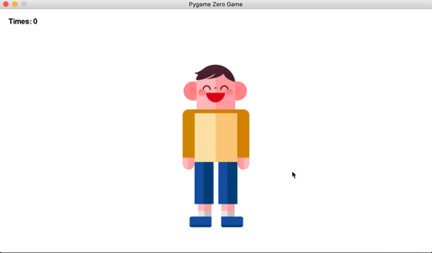

# 5.4 O'zingizga rasm chizish taxtasini yasang - Hodisa

Endi yettita misoldan 4-sini ko'rib chiqish vaqti keldi. Kitobning yakuniga oz qoldi. Kod miqdori, albatta, avvalgidan ko'proq bo'ladi. Biroq, tashvishlanishning hojati yo'q, chunki qiyinchiliklar bilimni oshirishda ijobiy xizmat qilishini tushunsak, biz uchun foydali bo'ladi.


```python
from pgzhelper import *

WIDTH = 960
HEIGHT = 540

chizish = False

qalam = Actor('pencil', (WIDTH / 2, HEIGHT / 2), anchor=('left', 'bottom'))
qalam.scale = 0.3
qalam.brush_init((WIDTH, HEIGHT), 5, 'blue')
ochirgich = Actor('eraser', (900, 50))
ochirgich.scale = 0.5

def draw():
    screen.fill('white')
    qalam.brush_draw()
    qalam.draw()
    ochirgich.draw()
    
    if chizish is False:
        qalam.brush_stop()

def on_mouse_move(pos):
    qalam.left, qalam.bottom = pos

def on_mouse_down(pos):
    global chizish
    chizish = True

    if ochirgich.collidepoint_pixel(pos):
        qalam.brush_clear()

def on_mouse_up():
    global chizish
    chizish = False
```


🔢 Keling birinchi 8-qatorda qalam nomli aktyor obyektini yaratuvchi kodni ko'rib chiqamiz. Obyektning langar qiymati (anchor qiymati) "chap", "pastki" ('left', 'bottom')ligi sababi Entry blokli kodlashdagi bilan bir xil. Buning sababi shundaki, ekranda qalam tanasidan chizish noodatiy, qalam uchidan chizishi tabiiydir.

<figure><figcaption></figcaption></figure>

🔢 6-qatorda bizga kerak bo'ladigan o'zgaruvchi yaratdik, u oldindan o'rnatilgan kutubxonadan bo'lmaganligi uchun uni birinchi marta ishlatamiz.  Uni yaratilish sababini nomidan tushungan bo'lsangiz kerak — **chizish** (men oldingi kitoblarda o'zgaruvchilarni yaratishda ularni mazmunli nomlash muhimligini bir necha bor aytib o'tganman), u _chizish_ uchun sichqoncha tugmasi bosilishini yoki _chizishni to'xtatish_ uchun sichqoncha tugmasidan barmoq ko'tarilganligini farqlash uchun ishlatiladi. Va nihoyat, biz faqat ikkita holatni bilishimiz kerak bo'lganligi sababli, mos keladigan o'zgaruvchan qiymatlar sifatida faqat **True/False** qiymatlaridan foydalanishimiz mumkin.

Biz chizish o'zgaruvchisini yarayish maqsadini va ishlatilishini tushunib oldik. Bu safar biz ushbu _o'zgaruvchining ta'rifi kod maydonida qayerda joylashganligini va nima uchun bu o'zgaruvchi funktsiya ishida emas, balki funktsiyadan tashqarida mavjud ekanligini bilib olishimiz kerak._ **Bu ma'lumot o'zgaruvchini qayerda yaratish haqidagi kodlash grammatika qoidalari haqida. Faqat ma'lum bir funktsiyada ishlatiladigan o'zgaruvchilar funktsiya ichida aniqlanadi va bir nechta funksiyalar bo'ylab butun kod bo'ylab birgalikda ishlatilishi kerak bo'lgan o'zgaruvchilar funktsiyalardan tashqarida aniqlanadi. Shuni ham bilingki, butun kod bo'ylab foydalanadigan o'zgaruvchilar global o'zgaruvchilar deb ataladi.**

🔢 Ko'rishingiz mumkin, **chizish o'zgaruvchisi ikkita joyda ishlatilgan**: 26-qatorda **on\_mouse\_up** qayta chaqirish funksiyasi (funksiya nomi **on\_** bilan boshlanganligi sababli, u PygameZero kutubxonasi tomonidan hodisaga (masalan, sichqoncha tugmasi bosilishi) koʻra avtomatik ravishda chaqirilishini bildiradi) ) va 33-qatorda **on\_mouse\_down** qayta chaqirish funksiyasi. U ikkala funktsiya tomonidan umumiy bo'lishi kerak bo'lgan o'zgaruvchi bo'lgani sababli funktsiyalardan tashqarida yaratilgan.

Keling, ushbu o'zgaruvchidan funktsiyada qanday foydalanishni batafsil ko'rib chiqaylik. **U funktsiyadan tashqaridagi o'zgaruvchi bo'lsa ham, avvalgiday siz shunchaki o'zgaruvchining qiymatini o'qib, uni funksiya ichida ishlatishingiz mumkin. Ammo, agar siz ushbu o'zgaruvchini funktsiya ichida o'zgartirmoqchi bo'lsangiz, Pythonning yangi grammatikasini bilishingiz kerak. 27 va 34 qatorlarda ko'rib turganingizdek, o'zgaruvchi nomining oldiga global kalit so'zini qo'shish orqali o'zgaruvchini e'lon qilishingiz kerak, bu o'zgaruvchining qiymatini o'zgartirishdan oldin uning funksiyadan tashqarida mavjudligini aniq ko'rsatadi.**


Aytgancha, bu erda ehtiyot bo'lish kerak. **Grammatikaga qat'iy rioya qilmaydigan Python-ning moslashuvchanligi afzallik, lekin shu bilan birga, bu kamchilik.** Agar siz global kalit so'zni aniq ishlatmasangiz va uni ishga tushirmasangiz, u oldindan xatosiz ishlaydi. Biroq, o'zgaruvchi qiymatini o'zgartirishga urinayotganda xatolik yuz beradi. Nima uchun siz xohlaganingizcha ishlamasligi haqida oldindan mantiqiy xatolarni topish oson bo'lmagan vaziyatlarga duch kelishingiz mumkin, shuning uchun ehtiyot bo'ling.


🔢 15 dan 18 gacha bo'lgan qatorlarda qayta chaqirish funksiyasi ichida fon rangi bo'yalgan va har bir paydo bo'lgan obyekt ekranda chizilgan. Bu vaqtda oldingi bobda aytib o'tganimizdek, har bir ob'ektning chizish funksiyalarini chaqirish tartibi, ya'ni har bir ob'ektni ekranda chizish tartibini hisobga olish kerak. Qalam ustidagi cho'tka eskizimiz kabi noqulay shakllar bo'lmasligi uchun tartibni yodda tuting.

🔢 20-21-qatorlarda cho'tka bilan chizishni qachon to'xtatish kerakligini bilish uchun chizma o'zgaruvchisi qiymatidan foydalanish uchun shartli bayonot ishlatiladi. Agar qiymat False bo'lsa, brush\_stop funksiyasi (usul) cho'tkadan foydalanishni to'xtatish uchun ishlatiladi.

🔢 23-24-qatorlar real vaqtda sichqoncha harakatlarini qalam obyektining markaziy koordinatalari bilan moslashtirish uchun ishlamoqda. Buning sababi, qalam ob'ekti sichqonchaning harakatlari bilan birga harakatlanishi mumkin. 24-qatorning sintaksisi biroz g'alati tuyulishi mumkin. Pos qiymatining o'zi bitta qiymatga o'xshaydi, lekin u (x, y) koordinata qiymatlariga ega bo'lgan kortejli qiymatdir. Kortejlar - bu biz hali o'rganmagan yangi ma'lumotlar turi, shuning uchun ularni bu safar batafsilroq ko'rib chiqamiz.


<figure><figcaption></figcaption></figure>
