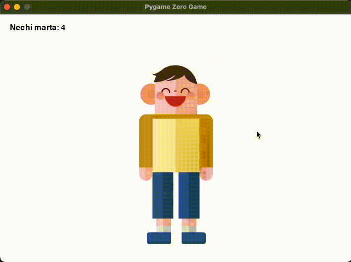

# 5.5 Qo'llarni cho'zgan holda sakrashlar sonini sanang - O'zgaruvchi

Entry blokli dasturlashda biz ko'pincha obyektlar animatsiyasidan foydalanganmiz. Pygame Zero-da ham xuddi shunday qilish mumkinmi? Albatta, mumkin. O'yinlardagi animatsiya odatiy holdir. Ushbu misolda biz birinchi marta Actor obyektlari animatsiyasidan foydalanamiz.


```python
from pgzhelper import *

WIDTH = 710
HEIGHT = 500

bola = Actor('boy_1', (WIDTH / 2, HEIGHT / 2))
bola.images = ['boy_1', 'boy_2', 'boy_3']

marta = 0
bosildi = False

def draw():
    screen.fill('white')
    bola.draw()
    screen.draw.text('Nechi marta: ' + str(marta), (20, 20), color='black')

def update():
    global marta, bosildi
    if bosildi:
        if bola.next_image() == 0:
            marta += 1
            bosildi = False

def on_mouse_down():
    global bosildi
    bosildi = True
```


🔢 7-qatorda tasvirlar deb nomlangan obyekt xossasi paydo bo‘ladi. Nomidan ko'rinib turibdiki, u bir nechta tasvirlarni ro'yxat formatida saqlaydi va uning maqsadi ob'ekt tasvirlarini jonlantirishdir. Roʻyxatdagi uchta rasm (boy\_1, boy\_2, boy\_3) oxir-oqibatda biz yozuvda koʻrgan sakrab oʻtayotgan bola obyektining uchta tasviri (shakllari) bilan bir xil.

<figure><figcaption></figcaption></figure>

🔢 Endi biz animatsiya mavzusiga kelganimizdan so'ng, avvalo tegishli kodni ko'rib chiqamiz. Yodingizda bo'lsa kerak, kirishda biz animatsiya uchun uchta tasvirning har birini ketma-ket aylantirib, animatsiya yaratganmiz. O'sha paytda biz tasvirlar orasida harakat qilish uchun "Keyingi shaklni o'zgartirish" deb nomlangan blokdan foydalanganmiz. 20-satrda ishlatiladigan keyingi\_image funksiyasi ushbu blokning qarama-qarshi rolini o'ynaydigan usul (funksiya) dir.

next\_image usulini bajargandan so'ng qaytarilgan qiymat natija qiymati sifatida tasvirlar ro'yxatidagi qaysi rasmga ko'chirilgan joy qiymatini (indeks qiymatini) qaytaradi. 20-qator shartli bayonotdir. Boy.next\_image() == 0 sharti oxir-oqibatda uchta tasvirdan iborat sakrash moslamalarining barcha qisman harakatlari tasvirlar orasidagi bir marta aylanish tugagandan so'ng bajarilganligini va u birinchi rasmga (indeks qiymati) qaytganini tekshirish uchundir. 0). Bu hozirgacha bajarilgan sakrash jaklarining umumiy sonini hisoblash uchun eng zo'r vaqt. Jami martalar soni to'planadi va vaqt o'zgaruvchisiga qo'shiladi, global o'zgaruvchi 9-qatorda e'lon qilingan.

🔢 10-qatorda e'lon qilingan global o'zgaruvchining maqsadini tushunasizmi? Uning maqsadi animatsiyani faqat sichqoncha tugmasi bosilganda amalga oshirishdir (faqat bosilgan qiymat 26-satrda True bo'lganda). Shuning uchun, animatsiya tugagandan so'ng, uni 22-satr kabi False holatiga qaytarish kerak. Shundan keyingina animatsiya yana sichqoncha tugmachasini bosgan holda davom etishi mumkin.

🔢 Nihoyat, 15-satrda matn deb ataladigan usul mavjud.Bu ekran obyekti ichidagi chizish obyekti ichida joylashgan funksiya, shuning uchun ekran.draw.text deb nomlangan ierarxik chaqiruv strukturasiga ega. O'tkazilgan argument qiymatlaridan ma'lum bo'lishicha, bu usulni ekranning qaysi joyida va qaysi matn rangida matnni chiqarish uchun qiymat o'tkazish orqali foydalanish mumkin. 'Vaqt: ' + str(vaqt) sintaksisi bu erda chiqarilgan qiymat yangi emas va Entry-Python kitobida bir necha marta ishlatilgan. U standart sifatida "+" operatoridan foydalangan holda chap va o'ngdagi ikkita matn qiymatini (string qiymatlari) birlashtiradi va yana bitta matn yaratadi. Shuningdek, o'rtada str(times) str deb nomlangan o'rnatilgan funksiyadan foydalanadi, lekin vaqt o'zgaruvchisi qiymati raqamli qiymat bo'lgani uchun uni matnni birlashtirish uchun ishlatib bo'lmaydi va birlashtirishdan oldin satrga aylantirilishi kerak.

Biz oldingi boblardan oldingi bilimlarni to'plaganimiz sababli, biz yangi kiritilgan narsalarni tezda o'rganishga muvaffaq bo'ldik. Nihoyat, biz ushbu misolning bajarilishi natijalarini ko'rib chiqish orqali ushbu bobni yakunlaymiz.

<figure><figcaption></figcaption></figure>
