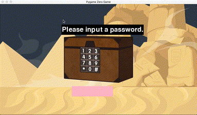

# 5.6 Xazina sandiqini ochish uchun parolni kiriting - Kiritish/Chiqarish

Biz sichqoncha kiritish qoplangan bo'lishi (drag, bosish, va boshqa) oldingi boblarda etarlicha. Ushbu bobda, sarlavhadan ko'rinib turibdiki, biz birinchi marta klaviatura kiritishni qayta ishlashni ko'rib chiqamiz va o'yinga qiziqish qo'shish uchun birinchi marta ovoz effektlari fayllari yordamida tovushlarni qanday chiqarishni o'rganamiz.

Oldingi beshta misolni hal qilganingiz uchun, endi siz Pygame Zero-da to'liq boshlovchi deb ayta olmaysiz. Qolgan ikkita misol uchun, kodning pastki qismidagi tushuntirishlarga qarash o'rniga, keling, butun kodni iloji boricha tushunishga harakat qilaylik, shunda biz uni ko'zimiz bilan tushunishimiz mumkin. Keyin, kodning pastki qismidagi tushuntirishlarni ko'rib chiqish tartibida davom etishga harakat qilaylik. Bunday o'rganish sizning mahoratingizni oshirishda davom etadi. Barchangiz tajribadan bilganingizdek, tezkor javoblar bizga hech qachon fikrlarimizni rivojlantirish imkoniyatini bermaydi.


```python
from pgzhelper import *

WIDTH = 960
HEIGHT = 540

treasure = Actor("treasure_box", (WIDTH / 2, HEIGHT / 2))

input_text = ""
input_done = False
input_rect = Rect(350, 400, 200, 50)

guide_rect = Rect(300, 100, 400, 50)
password = "1234"

def draw():
    screen.blit("desert", (0, 0))
    treasure.draw()
    screen.draw.filled_rect(guide_rect, 'black')
    screen.draw.textbox("Parolni kiriting.", guide_rect, fontname='nanum_square')
    screen.draw.filled_rect(input_rect, "pink")
    screen.draw.textbox(input_text, input_rect)

    if input_done:
        screen.draw.filled_rect(guide_rect, 'black')

        if input_text == password:
            screen.draw.textbox("Xazina sizniki!", guide_rect)
            sounds.cheer.play()
        else:
            screen.draw.textbox("Parol to'g'ri emas!", guide_rect)
            sounds.warning.play()

        pygame.display.update()
        game.exit()

def on_key_down(key, unicode):
    global input_text, input_done

    if key == keys.RETURN:
        input_done = True
    elif key == keys.BACKSPACE:
        input_text = input_text[:-1]
    else:
        input_text += unicode
```


🔢 Birinchidan, ushbu kodda bir necha marta ishlatiladigan Rect haqida bilib olaylik. Uning bosh harf bilan boshlanganiga qaraganda, biz buni ko'rishimiz mumkin Rect ob'ekt. Rect to'rtburchakning qisqartmasi bo'lib, u kvadrat shaklidagi maydonni egallaydigan ob'ektdir. O'yin sahnasida paydo bo'ladigan ob'ektlarning aksariyati asosan kvadrat shaklidagi narsalar bo'lgani uchun, biz ushbu Rektdan taniqli foydalanilgan deb aytishimiz mumkin. Uni yaratish usuli to'rtta argument qiymatlari (chap, yuqori, kenglik, balandlik) bilan kvadrat maydonni ifodalashdir. Birinchi ikkita qiymat (chap, yuqori) yuqori chap koordinata qiymatlari bo'lib, ekrandagi kvadrat maydonning boshlang'ich pozitsiyasini ko'rsatadi va oxirgi ikkita qiymat (kenglik, balandlik) gorizontal va vertikal uzunliklardir va bu qiymatlar maydonning o'lchamini aniqlaydi.

Ilgari biz ushbu misolni kirish orqali yaratganimiz sababli, ushbu misol foydalanuvchi bilan matnli o'zaro ta'sirga ega ekanligini ko'rishimiz mumkin. Biz foydalanuvchini xazina sandig'ini ochish uchun parolni kiritishga yo'naltiramiz va kiritilgan parol to'g'ri yoki yo'qligiga qarab, u oxirgi xazinani olganmi yoki yo'qmi, ovoz bilan birga matnni ko'rsatamiz. Shunday qilib, biz ushbu misolda ikkita Rektga muhtojmiz, ulardan biri foydalanuvchi parolni kiritadigan kirish qutisi (input\_rect) sifatida ishlatiladi, ikkinchisi esa maydon sifatida ishlatiladi (guide\_rect) bu erda foydalanuvchiga harakat haqida ko'rsatma berish yoki natijani boshqarish uchun matn ko'rsatiladi.

🔢 9-qatordagi input\_done o'zgaruvchisi quyidagi eslatmada ko'rsatilgan bayroq o'zgaruvchisidir va saqlangan qiymat ikkita qiymatdan biridir: True/False.


Bayroq o'zgaruvchisi: dasturlashda kodlar orasidagi holatni ko'rsatish uchun ishlatiladigan true yoki False yoki 0 yoki 1 (boolean) ikkilik qiymatiga ega o'zgaruvchi.

Malumot: Wikipedia ([https://en.wikipedia.org/wiki/Flag\_(programming)](https://en.wikipedia.org/wiki/Flag\_\(programming\)) )


Aslida, bayroq o'zgaruvchisi bu safar birinchi marta ko'rinmayapti. U 5.3-bob misolidan beri doimiy ravishda paydo bo'lib kelmoqda. U asosan sichqoncha va klaviatura kiritilishini qayta ishlash jarayonida qo'llaniladi va kirish moslamasidan kirish qachon tugaganligini aniqlash uchun ishlatiladi. Input\_done qachon haqiqatga aylanadi? Haqiqiy qiymat 40-qatorda saqlanadi, bu parol raqamlarini kiritgandan so'ng Enter tugmasini bosish orqali parolni kiritish nihoyat tugaydigan vaqt. Chizish funktsiyasida parolning to'g'ri yoki noto'g'ri ekanligini natijani qayta ishlash input\_done qiymati 22-qatorda to'g'ri bo'lgan vaqtga qarab amalga oshiriladi.

Dastlab bayroq o'zgaruvchilaridan ko'p foydalanadigan kodlash uslubi odatda tavsiya etilmaydi. Bayroq o'zgaruvchilari qancha ko'p ishlatilsa, kod shunchalik murakkablashadi, bu kodni saqlash nuqtai nazaridan noqulay. Biroq, uni asosan Pygame Zero kutubxonasi kabi katta o'yin ko'chadan va qayta qo'ng'iroq funktsiyalaridan foydalanadigan tuzilmalarda ishlatish muqarrar ekanligini tushunish yaxshi bo'lar edi.

🔢 Ekranga qaraylik.chizish.liniyada textbox usuli 19. Bu ekrandan unchalik farq qilmaydi.chizish.oldingi bobda ko'rib chiqilgan matn . Usul chaqiruvida ishlatiladigan argument qiymatlarini solishtirish yaxshi bo'lardi. Matn tarkibi chiqarilishi kerak bo'lgan maydon Rektor yordamida taqdim etiladi. Chizish usulida faqat matn chiqish joyini ko'rsatish va textbox usulida chiqish maydonini ko'rsatish o'rtasida farq bor. Agar siz uni Rektor sifatida taqdim etsangiz, matn tarkibi maydondan oshmaydigan oraliqda ifodalanishi mumkin bo'lgan maksimal shrift hajmida chiqariladi.

Ushbu sobit chiqish maydoni bizning maqsadimizga mos keladi, chunki bu sohadagi matn mazmuni o'zgarib turadi. Bunday holda, yangi matn yozishdan oldin, biz 18 va 24-qatorlar kabi avval yozilgan matnni o'chirib tashlashimiz va keyin uning ustiga yozishimiz kerak. Ammo, agar maydon aniqlangan bo'lsa, mavjud matnni butunlay yo'q qilish oson. Agar matn yozilgan maydon o'zgaruvchan bo'lsa, bu noqulay, chunki biz har safar o'zgaruvchan maydonni eslab qolishimiz va boshqarishimiz kerak.

Bundan tashqari, matn chiqarish uchun ishlatiladigan shrift argument qiymati shrift nomi='nanum\_square' sifatida ko'rsatiladi va uzatiladi. [5.1-bob](https://roboticsware.gitbook.io/pygame\_zero-entry\_basic/5.-start-coding/5.1.3-kuchuk-mushuk)da bilib olganimizdek, bu koreyscha matnni chiqarish uchun koreys shriftidan foydalanish uchun kerak. Bundan tashqari, matnni turli shakllarga aylantirish uchun turli xil ixtiyoriy argument qiymatlari mavjud. Qo'shimcha ma'lumot olish uchun [shu yer](https://pygame-zero.readthedocs.io/en/stable/ptext.html)da kutubxona qo'llanmasiga murojaat qiling.

🔢 O'yinlarda ovoz effektlaridan foydalanish deyarli zarur. Foydalanishning o'zi qiyin emas. Shunchaki **sounds.ovoz\_fayl\_nomi.play** usulini chaqiring, 28 va 31 qatorlardagi kabi. Ovoz effektlari manbalardan biridir (rasmlar, shriftlar, tovushlar va boshqalar.) o'yinda ishlatiladi va mavjud resurslarni boshqarish bir xil, ammo tegishli fayllar oldindan tovushlar deb nomlangan papkada saqlanishi kerak. Iltimos, barcha ovozli fayl formatlari qo'llab-quvvatlanmasligini va faqat vav va ogg formatlarini ijro etish mumkinligini unutmang.

Ovozni ikki turga bo'lish mumkin: o'yindagi aniq voqealar uchun ishlatiladigan ovoz effektlari va o'yin davomida ijro etiladigan fon tovushlari. Orqa fonda ovozni ijro etish uchun siz Pygame Zero tomonidan taqdim etilgan musiqa ob'ektidan foydalanishingiz mumkin . Batafsil foydalanish uchun kutubxona qo'llanmasiga murojaat qiling [bu yer](https://pygame-zero.readthedocs.io/en/stable/builtins.html#music)ga.

🔢 Va nihoyat, 36-satrda har bir tugma bosilganda yuzaga keladigan on\_key\_daun callback funksiyasini batafsil ko'rib chiqamiz. Har safar tugma bosilganda ikkita parametr, kalit va unicode birgalikda uzatiladi. Kalit qaysi tugma bosilganligini aniqlash uchun ishlatiladi va agar bosilgan tugma maxsus kalit bo'lmasa (masalan, ctrl, shift, esc), lekin belgi/raqam qiymatiga ega bo'lsa, qiymatni olish uchun unicode ishlatiladi. Shuning uchun input\_text += unicode 44-satrdagi bayonot klaviaturada bosilgan qiymatlarni input\_text deb nomlangan satr o'zgaruvchisida to'plash uchun ishlatiladi.

Agar foydalanuvchi parolni kiritishda noto'g'ri raqamni kiritsa, u Foydalanuvchiga Backspace tugmachasini bosib uni o'chirishga imkon beradigan funktsiyani ham taqdim etadi. 41-42 qatorlarni amalga oshirish tarkibdir. Ba'zi odamlar input\_text\[:-1] grammatik ifodasini 42-qatorda birinchi marta ko'rishlari mumkin. Ushbu grammatika Python tilining boshqa tillarda keng tarqalmagan juda qulay dilimlash grammatik iboralaridan biridir. Oddiy qilib aytganda, -1 ma'nosidan kelib chiqadigan bo'lsak, u oxirgi belgidan tashqari input\_text string qiymatining qolgan qiymatlarini qaytaradi. Shuning uchun u oxirgi belgini o'chirish effektini yaratishi mumkin. Dilimlash grammatikasini bilish foydalidir, ammo tushuntirish uchun juda ko'p tarkib mavjud, shuning uchun bobning mazmunini juda uzun qilish uchun qisqartirish o'rniga, men grammatikani tushuntiradigan internetdagi yaxshi manbalardan birini tavsiya qilaman.

Endi biz 6-misolning bajarilish natijalarini tekshirishni tugatganimizdan so'ng, ushbu kitobning oxirgisi bo'lgan 7-misolga o'tamiz.

<figure><figcaption></figcaption></figure>
