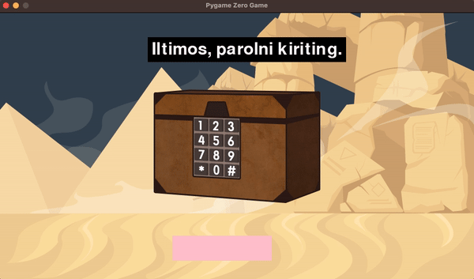

# 5.6 Xazina sandiqini ochish uchun parolni kiriting - Kiritish/Chiqarish

Biz o'tgan boblarda sichqoncha kiritish (sudrash, bosish va hokazo) bilan yetarlicha tanishib chiqdik. Ushbu bobda, nomidan ko'rinib turibdiki, birinchi marta klaviatura kiritilishini ko'rib chiqamiz va o'yinni yanada qiziqarli qilish uchun tovushli fayllar orqali qanday qilib ovoz chiqarishni o'rganamiz.

Siz oldingi 5 ta misolni bajarganingiz uchun endi sizni Pygame Zero dasturida mutlaqo yangi boshlovchi deb bo'lmaydi. Endi qolgan 2 ta misolni kodning oxiridagi izohni darhol ko'rishdan ko'ra, to‘liq kodni bir qarashda tushunishga harakat qiling. Shundan so'ng, pastdagi kod izohlarini ko'rish tartibida davom etishga harakat qilamiz. Kelgusida ham bunday o'qish sizning ko'nikmalaringizni oshirish yo'li bo'ladi. Sizlar ham tajribangizdan yaxshi bilasizki, tez javoblar hech qachon bizning fikrlash qobiliyatimizni rivojlantirishga imkon bermaydi.


```python
from pgzhelper import *

WIDTH = 960
HEIGHT = 540

xazina = Actor("treasure_box", (WIDTH / 2, HEIGHT / 2))
xazina.images = ["treasure_box", "treasure_box_o"]

input_text = ""
input_done = False
input_rect = Rect(350, 450, 200, 50)

guide_rect = Rect(300, 50, 400, 50)
parol = "1234"

def draw():
    screen.blit("desert", (0, 0))
    xazina.draw()

    # Guide textbox
    screen.draw.filled_rect(guide_rect, 'black')
    if input_done:
        if input_text == parol:
            screen.draw.textbox("Xazina sizniki!", guide_rect)
        else:
            screen.draw.textbox("Parol noto'g'ri!", guide_rect)

        pygame.display.update()
        game.exit()
    else:
        screen.draw.textbox("Iltimos, parolni kiriting.", guide_rect)

    # Input textbox
    screen.draw.filled_rect(input_rect, "pink")
    screen.draw.textbox(input_text, input_rect)


def update():
    if input_done:
        if input_text == parol:
            xazina.sel_image("treasure_box_o")
            sounds.cheer.play()
        else:
            sounds.warning.play()


def on_key_down(key, unicode):
    global input_text, input_done

    if key == keys.RETURN:
        input_done = True
    elif key == keys.BACKSPACE:
        input_text = input_text[:-1]
    else:
        input_text += unicode
```


🔢 Keling, avval ushbu kodda bir necha marta ishlatilgan Rect haqida bilib olaylik. Nomining bosh harf bilan boshlanishidan, Rect obyekt ekanini bilib olish mumkin. Rect - bu Rectangle (to'rtburchak) so'zining qisqartmasi va u to'rtburchak shaklidagi maydonni ushlab turuvchi obyekt bo'lib, o'yin sahnasida paydo bo'ladigan ko'pchilik obyektlar asosan to'rtburchak shaklida bo'lgani uchun Rect ishlatish keng tarqalgan. Uni yaratish uchun 4 ta qiymat (left, top, width, height) kerak bo'ladi. Birinchi ikkita qiymat (left, top) - bu to'rtburchakning ekranda qayerdan boshlanishini ko'rsatuvchi yuqori chap burchak koordinatalari, oxirgi ikkita qiymat (width, height) esa to'rtburchakning kengligi va balandligi bo'lib, ular bu maydonning o‘lchamini belgilaydi.

<figure><figcaption></figcaption></figure>

Biz bu misolni ilgari Entry orqali yaratib ko'rganimiz uchun, ushbu misolda foydalanuvchi bilan matn orqali aloqa borligini bilamiz. Xazina sandig'ini ochish uchun parol kiritish talab qilinadi va kiritilgan parol to'g'ri yoki noto'g'riligiga qarab, yakunda xazinani olganingiz yoki yoqmi ovoz va matn bilan ko'rsatiladi. Shunday qilib, biz ushbu misolda ikkita Rect kerakligini aniqlaymiz: biri foydalanuvchidan parolni kiritishni qabul qiladigan to'rtburchakli kiritish maydoni (input\_rect), ikkinchisi esa foydalanuvchiga nima qilish kerakligini yoki natijani ko'rsatadigan matn maydoni (guide\_rect) sifatida ishlatiladi.

🔢 9-qatordagi **input\_done** o'zgaruvchisi flag (bayroq) o'zgaruvchisi bo'lib, pastdagi eslatmalarda aytilgan. U True (rost) yoki False (yolg'on) qiymatlaridan birini qabul qiladi.


Flag o'zgaruvchisi: dasturlashda kodlar orasidagi holatni ko'rsatish uchun ishlatiladigan True yoki False yoki 0 yoki 1 (boolean) ikkilik qiymatiga ega o'zgaruvchi.

Malumot: Wikipedia ([https://en.wikipedia.org/wiki/Flag\_(programming)](https://en.wikipedia.org/wiki/Flag\_\(programming\)) )


Aslida flag (bayroq) o'zgaruvchisi birinchi marta paydo bo'layotgani yo'q, u 5.3-bo'limdagi misollardan boshlab doim ishlatilgan. Uni asosan kiritish qurilmalari, masalan, sichqoncha va klaviatura yordamida kiritish tugagan paytni aniqlash uchun ishlatishadi. Qachon input\_done True (rost) qiymatiga ega bo'ladi? Bu ma'lumot 51-qatorda saqlanadi, parol raqamlari kiritilgandan so'ng Enter tugmasi bosilib, parol kiritish tugaganida **draw** funksiyasida 23-qatorda input\_done qiymati True bo'lganda parol to‘g‘ri yoki noto‘g‘ri kiritilgani aniqlanadi.

_Odatda flag o‘zgaruvchilarini ko‘p ishlatadigan kod yozish uslubi tavsiya etilmaydi, chunki bu kodning murakkabligini oshiradi va kodga texnik xizmat ko'rsatish qiyinlashadi. Ammo Pygame Zero kabi katta o‘yin takrorlashlari (game loop) va qayta chaqirish (callback) funksiyalariga asoslangan strukturalarda ularni ishlatishning muqarrar tomoni borligini tushunish foydali bo‘lishi mumkin._

🔢 24, 26, 31-qatorlarda ishlatilgan **screen.draw.textbox** metodiga nazar solaylik. Ilgari ko'rganimiz **screen.draw.text** metodidan unchalik farq qilmaydi. Metod chaqirilganda ishlatilgan argumentlarni solishtirsak, matn chiqarilishi kerak bo'lgan joy Rect orqali berilmoqda. **draw** metodida faqat matnning joylashuvini belgilash kerak bo'lsa, **textbox** metodida esa chiqarish maydoni belgilanadi. _Agar Rect bilan belgilansa, u holda maydondan chiqmasdan matn maksimal kattalikda chiqariladi._

Chiqarish maydonining hajmi doimiy bo‘lishi bizning maqsadimizga mos keladi, chunki ushbu maydonda matnning mazmuni doimiy ravishda o'zgarib turadi. Bunday holatda yangi matn yozishdan oldin eski matnni o'chirish kerak bo'ladi va maydonning doimiy bo‘lishi o‘chirishni osonlashtiradi. Agar maydon o‘zgaruvchan bo‘lsa, uni har safar eslab qolish va boshqarish kerak bo‘ladi. Shuningdek, **screen.draw.filled\_rect** metodidan foydalanib, Rect-ga fon rangini berishimiz matnni aniqroq ko‘rinishiga yordam beradi va avvalgi matnni o‘chiradi.

Ekranda ko‘rsatiladigan matnlar uchta asosiy holatni ifodalaydi: 31-qatorda parol kiritishdan oldingi holat, 24 va 26-qatorlarda esa parolning to‘g‘ri yoki noto‘g‘riligiga bog‘liq bo‘lgan natija. Parol kiritilishi tugagandan so‘ng, 28-qatorda ishlatilgan **pygame.display.update()** metodi orqali natija darhol ekranga chiqariladi va **game.exit()** metodi bilan o‘yin tugatiladi, va shu bilan Pygame dasturi tugaydi.

🔢 Agar parol kiritilishi muvaffaqiyatli bo‘lsa, xazina sandig‘i ochilgan tasviriga o'zgarishi kerak. Bunday holda, Actor obyektining tashqi ko‘rinishini o‘zgartirish va ovozli effektni chiqarish kabi jarayonlar **update()** callback (qayta chaqirish) funksiyasi ichida amalga oshirilishi kerakligini yodda tuting. [Oldingi bob](5.5-sakrashni-sanash.md)da Actor obyektining tashqi ko‘rinishi bir nechta tasvirdan tashkil topganida, tasvirlarni almashtirish uchun **next\_image** metodidan foydalangan edik. Biroq, bu safar 41-qatorda ma'lum bir tasvirni to‘g‘ridan-to‘g‘ri almashtirish uchun **sel\_image** metodidan foydalanildi.

O'yinda ovoz effektlaridan foydalanish foydalanuvchini jalb qilish va o'yin qiziqarligini oshirish uchun deyarli ajralmas deb aytish mumkin. Uni ishlatish qiyin emas. 42 va 44-qatorlardagi kabi **sounds.ovozfaylnomi.play** metodi orqali chaqiriladi. Ovoz effektlari o'yinda ishlatiladigan resurslar (rasmlar, shriftlar, tovushlar va hokazo) qatoriga kiradi va avvalgi resurslar kabi boshqariladi, lekin ovoz fayli oldindan **sounds** nomli papkada saqlangan bo'lishi kerak. Ovoz fayllari barcha formatlarni qo'llab-quvvatlamaydi, faqat **wav** va **ogg** formatlaridan foydalanishni unutmang. Ovozlarni ikkita bo'limga bo'linadi: o'yindagi muayyan hodisalar uchun ishlatiladigan ovoz effektlari va butun o'yin davomida yangraydigan fon musiqasiga bo'linadi. Fon musiqasini ijro etish uchun **Pygame Zero** tomonidan taqdim etilgan **Music** obyektidan foydalanish mumkin. Undan qanday foydalanishni [kutubxona qo'llanmasi](https://pygame-zero.readthedocs.io/en/stable/builtins.html#music)dan o'rganish tavsiya etiladi.

🔢 Nihoyat, 47-qatordagi har safar klaviatura tugmasi bosilganda ishlaydigan **on\_key\_down** qayta chaqirish (callback) funksiyasini ko'rib chiqamiz. Klaviatura tugmachasi bosilganida, key va unicode qiymatlari uzatiladi. Key qaysi tugma bosilganligini aniqlash uchun ishlatiladi, unicode esa maxsus tugma emas (ctrl, shift, esc), balki harf yoki raqam bo'lsa, bu qiymatni oladi. 44-qatordagi **input\_text += unicode** kodi klaviaturada bosilgan qiymatni **input\_text** o'zgaruvchisiga qo'shib boradi.

Agar foydalanuvchi parolni noto‘g‘ri kiritgan bo‘lsa, u **Backspace** tugmasini bosib o‘chira oladi. Bu 52-53-qatorlarda amalga oshirilgan. 53-qatordagi **input\_text\[:-1]** sintaksisi Python tilining qulay **slicing** (kesish) metodlaridan biri bo'lib, boshqa tillarda bu odatda mavjud emas. -1 qiymati **input\_text** ning oxirgi belgisi tashlab yuborilishini bildiradi va shu tariqa oxirgi belgi o‘chiriladi. Slicing juda foydali bo'lsada, bu mavzu ancha uzunlashib ketdi, shuning uchun yaxshisi internetdagi yaxshi manbalarni o'rganishni tavsiya qilamiz.

6-misolning natijasini tekshirib chiqqanimizdan so‘ng, kitobning so‘nggi, 7-misoliga o‘tamiz.

<figure><figcaption></figcaption></figure>
