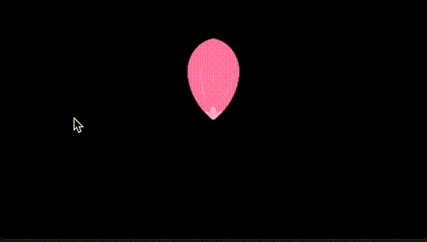

# 5.2 Bitta gulbargdan gul yasash (Takrorlash)


Ushbu bob "**takrorlash**"ni o'rganish uchun Entry boshlang'ich kitobining ikkinchi misolidir. Oldingi bobda biz allaqachon Pygame Zero tomonidan taqdim etilgan obyektlardan foydalangan holda kodlashning asosiy va muhim mazmunini ko'rib chiqdik, shuning uchun qolgan misollarning kodlanishini tushunish bundan buyon unchalik qiyin bo'lmasligini kutishimiz mumkin. Shuning uchun biz faqat oldingi boblarda o'rganilmagan yangi kiritilgan kodlarga e'tibor qaratamiz, mavjud tarkibni takrorlamasdan.


```python
from pgzhelper import *

WIDTH = 480
HEIGHT = 270

leaf = Actor('pink_leaf', (WIDTH / 2, HEIGHT / 2), anchor=('middle', 'bottom'))
leaf.scale = 0.5

def draw():
    for _ in range(6):
        leaf.draw()
        leaf.angle += 60
```


Yangi paydo bo‘lgan kod 6-qatorida birinchi marta uchraydi va avval Actor obyektini yaratish hamda ishlatishda uchramagan **anchor** nomli xususiyat paydo bo‘ladi. Anchor so‘zining lug‘at ma’nosi kemani harakatsiz turishi uchun joyiga mahkamlovchi 'langar'ni anglatadi va shu ma’no orqali uning maqsadini taxmin qilish mumkin. To‘g‘ri javobni aytadigan bo‘lsak, **bu har bir obyektning markaziy nuqtasi bo‘lib, biz buni Entry blokli kodlashda ham ishlatgan edik, Pygame Zeroda esa bu anchor deb ataladi.**

Entry dasturida ham shunday edi: **odatda Actor obyektining standart anchor qiymati rasmdagi markaziy nuqta (center) bo‘ladi.** Ammo zaruratga ko‘ra, obyektning markaziy nuqtasini ekranda ko‘rsatilganidek obyektning pastki o‘rta qismi (middle-bottom yoki bottom-middle)ga ko‘chirish mumkin. Bunday holatda, Actor obyektining anchor xususiyatiga **anchor=('middle', 'bottom')** qiymatini o‘rnatib, obyektni yaratish kifoya.

Ushbu misolda, nega markaziy nuqta gultojining o‘rtasida emas, uning pastki chetida joylashishi kerakligini siz allaqachon Entry blokli kodlashda amaliyot qilib tushunganingizga ishongan holda, qisqacha tushuntiradigan bo‘lsak, gultojining qaysi qismi markaz qilib olinib, u doira bo‘ylab aylanganda butun bir gul shakllanishi markaziy nuqtaning qayta o‘rnatilishini talab qiladi.

\


<figure><figcaption></figcaption></figure>

Endi ilgari foydalanib ko‘rmagan Actor obyektining faqat bitta xususiyati qolgan, u esa 12-qatordagi **angle** xususiyatidir. Bu xususiyat, nomidan ham taxmin qilish mumkinki, obyektni burchak ostida aylantirib ekranga chiqarish uchun mo‘ljallangan. Butun gul shaklini yaratish uchun, har bir gulbargni chizishdan oldin 60 daraja aylantirib, jami 6 marta takrorlash orqali dumaloq (360 daraja) to‘liq gul hosil qilish maqsad qilingan. Lekin, diqqat qilish kerak bo‘lgan jihat shuki, quyidagi rasmda ko‘rsatilganidek, Actor obyektining aylanish yo‘nalishi soat yo‘nalishi bo‘yicha (CW: ClockWise) yoki teskari soat yo‘nalishi bo‘yicha (CCW: Counter ClockWise) ekaniga qarab, **angle** qiymati musbat yoki manfiy bo‘lishi mumkin.

<figure><figcaption></figcaption></figure>

Agar oldingi boblarning asosiy tushunchalarini yetarlicha o'zlashtirgan bo'lsangiz, keyingi bobni tushunish qiyin bo'lmasligi kerak. Va nihoyat, keling, dasturimizni natijalarini ko'rib chiqish orqali ushbu bobni yakunlaymiz va keyin uchinchi misolga o'tamiz.

<figure><figcaption></figcaption></figure>

E'tibor bering, yuqoridagi kodni ishlatganda rasmdagidek bosqichma-bosqich chizilishni ko'rmaysiz. Qadamma-qadam chizishni ko'rmoqchi bo'lganlar uchun men qo'shimcha kodni qoldiraman. E'tibor bering, obyektning draw kolbek funksiyasi chaqirilsa ham, u ekranda ichki chizilmaydi, shuning uchun **pygame.display.update()** funksiyasi(metodi) orqali darhol chizishga majburlash uchun kod qo'llanilganligini ko'rishingiz mumkin.


```python
from pgzhelper import *
import pygame

WIDTH = 480
HEIGHT = 270

leaf = Actor('pink_leaf', (WIDTH / 2, HEIGHT / 2), anchor=('middle', 'bottom'))
leaf.scale = 0.5

def draw():
    for _ in range(6):
        leaf.draw()
        pygame.display.update()
        game.time.sleep(0.5)
        leaf.angle += 60
```

